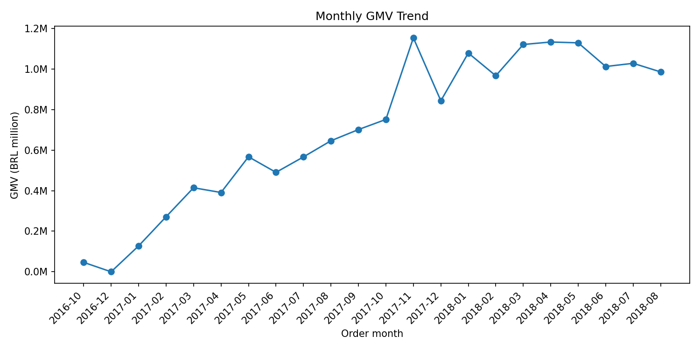
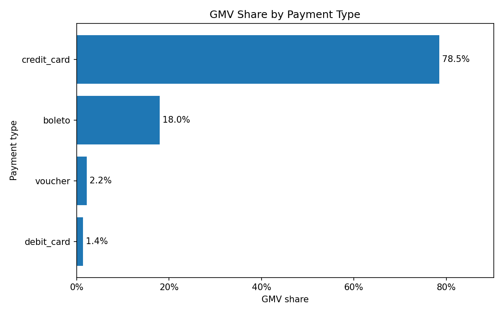
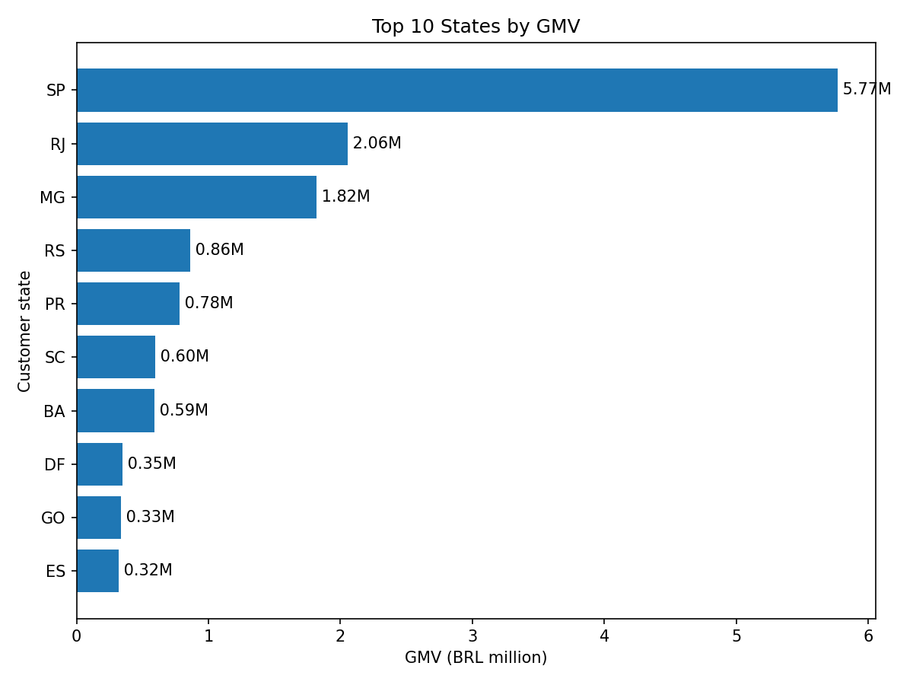
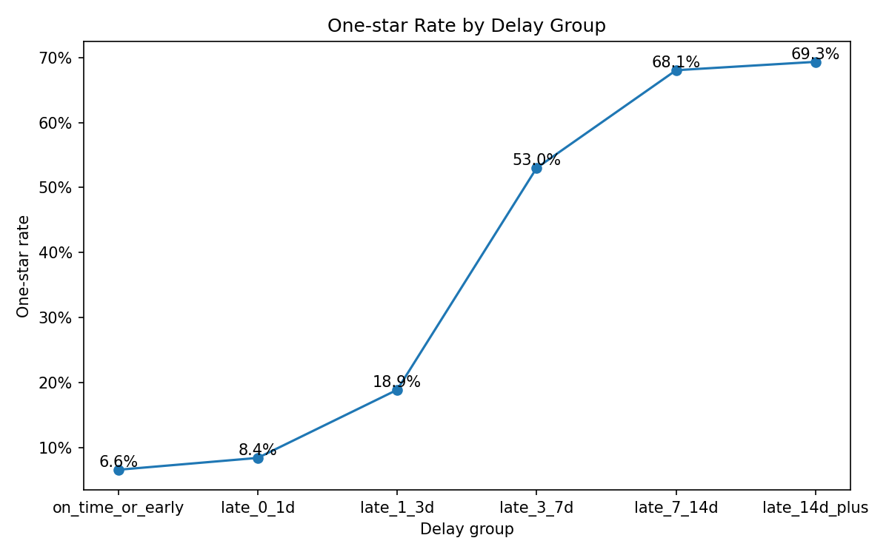
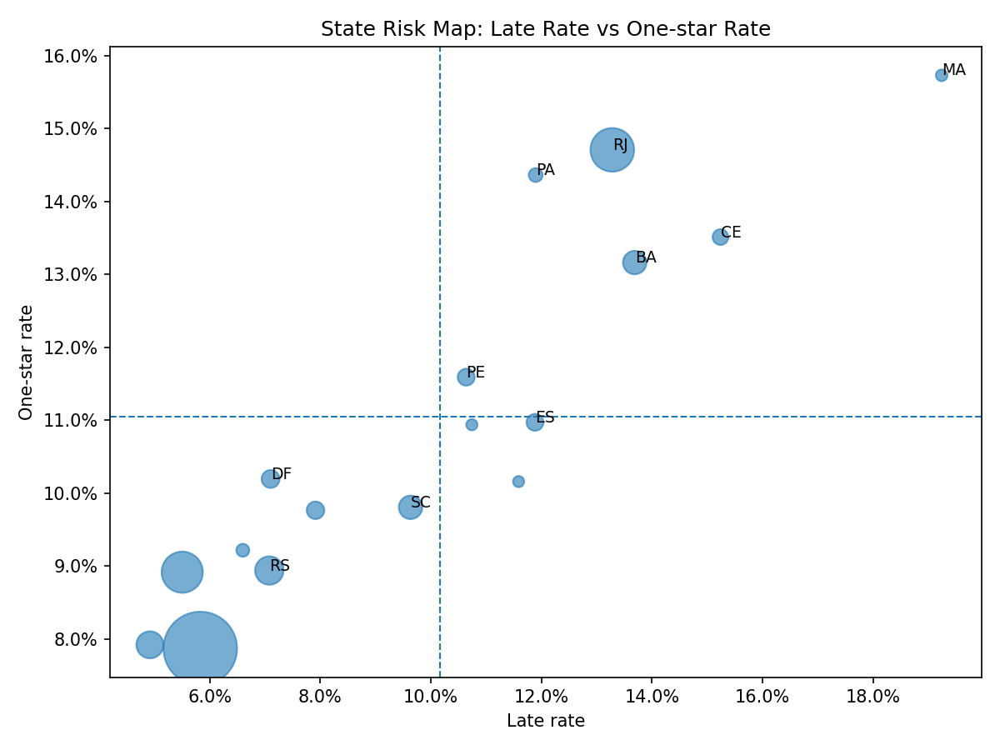

# Olist电商经营诊断分析：销售表现、履约时效与客户评分洞察

## 项目概览

本项目围绕“履约延迟是否会显著抬高客户差评风险”展开，基于Olist电商多表数据构建订单级宽表，并进一步完成销售基本盘、履约评分、风险分层、地区治理优先级和运营干预建议。

| 核心指标 | 结果 |
|---|---:|
| 销售分析订单数 | 96,477 |
| GMV | 1542.25万 |
| 履约评分分析订单数 | 95,824 |
| 整体延迟率 | 7.99% |
| 延迟订单平均评分 | 2.57 |
| 准时或提前订单平均评分 | 4.29 |
| 延迟订单1星差评率 | 46.15% |
| 准时或提前订单1星差评率 | 6.55% |
| 延迟超过3天订单数 | 5,020 |

## 项目交付物

| 交付物 | 路径 | 说明 |
|---|---|---|
| 项目说明与结论 | README.md | 展示项目背景、分析流程、核心发现、业务建议和运行方式 |
| Python分析过程 | notebooks/ | 包含数据理解、宽表构建、销售分析、履约评分分析、风险分层和图表导出 |
| SQL复现脚本 | sql/ | 使用MySQL 8.0复现核心业务指标查询 |
| 核心图表 | outputs/figures/ | README中展示的关键图表 |
| BI分析数据表 | outputs/bi/bi_order_base.csv | 面向Power BI的数据表，由notebook本地生成，不上传GitHub |
| Power BI看板 | outputs/powerbi/olist_delivery_risk_dashboard.pbix | 基于BI数据表制作的可视化看板 |

## 1.项目背景

Olist是一个巴西电商平台公开数据集，包含订单、客户、商品、卖家、支付、评价、物流时间等多张业务表。与单张销售明细表不同，该数据集更接近真实业务中的关系型数据库结构，能够展示多表关联、订单级宽表构建和电商经营分析能力。

本项目不将分析重点放在前端流量漏斗，因为数据集中缺少曝光、点击、加购、收藏等完整用户行为日志。因此，本项目聚焦于成交后的经营链路，围绕销售表现、履约时效、客户评分和运营干预优先级进行分析。

本项目的核心问题是：平台成交后的经营质量如何？物流履约是否影响客户满意度？如果存在履约风险，哪些地区和订单应该被优先治理？

## 2.业务问题

本项目主要回答以下问题：

1.平台整体销售基本盘如何？GMV、订单量、客单价、地区分布和支付方式结构有什么特征？

2.订单履约表现如何？整体配送时长、延迟率和不同地区履约差异如何？

3.履约延迟是否与客户评分下降、1星差评率上升有关？

4.延迟到什么程度后，差评风险明显上升？

5.哪些地区同时具备较高GMV、较高延迟率和较高1星差评率，应该优先治理？

6.平台可以如何基于风险分层设计主动通知、客服跟进或补偿策略？

## 3.数据说明

数据来源：Kaggle Brazilian E-Commerce Public Dataset by Olist

本项目主要使用以下数据表：

| 数据表 | 主要作用 |
|---|---|
| olist_orders_dataset | 订单主表，包含订单状态、下单时间、实际送达时间、预计送达时间 |
| olist_order_items_dataset | 订单商品明细表，包含商品价格、运费、商品ID、卖家ID |
| olist_order_payments_dataset | 支付明细表，包含支付方式、分期数、支付金额 |
| olist_order_reviews_dataset | 订单评价表，包含1到5星评分和评论信息 |
| olist_customers_dataset | 客户信息表，包含客户ID、用户唯一ID、城市和州 |
| olist_products_dataset | 商品信息表，包含商品品类和商品属性 |
| olist_sellers_dataset | 卖家信息表，包含卖家所在地 |
| product_category_name_translation | 商品品类英文翻译表 |
| olist_geolocation_dataset | 邮编地理位置表，本项目第一版暂未深入使用 |

由于原始数据涉及多张不同粒度的业务表，本项目先进行表粒度检查，再构建订单级分析宽表，避免一对多表直接JOIN导致订单数、金额和评分重复计算。

### 样本口径说明

本项目根据不同分析目标使用不同样本口径：

销售基本盘分析使用已送达且金额字段完整的订单，主要用于统计GMV、客单价、支付方式和地区销售分布。

履约评分分析使用已送达、履约时间字段完整且存在评分的订单，主要用于分析delivery_days、delay_days和review_score之间的关系。

风险优先级分析使用已送达、金额字段完整、履约字段完整且评分完整的订单，主要用于同时比较GMV、延迟率、1星差评率和地区治理优先级。

因此，不同章节中的订单数可能略有差异，这是由分析目标和字段完整性要求不同造成的。

## 4.分析流程

### 4.1数据理解与表粒度检查

在01_data_overview.ipynb中，首先检查9张原始表的行列数、字段类型、缺失值、重复值和候选主键。

主要结论：

orders表中order_id唯一，可作为订单主表，粒度为一行一个订单。

order_items表中order_id不唯一，order_id+order_item_id可以唯一标识订单商品明细，说明该表是一行一个订单商品项。

payments表中order_id不唯一，说明一个订单可能有多笔支付记录。

reviews表中review_id可作为评价记录ID，但order_id存在少量重复，说明合并到订单级宽表前需要先聚合。

customers表中customer_id唯一，可用于orders和customers之间的关联；customer_unique_id不唯一，可用于后续用户级复购分析。

### 4.2构建订单级宽表

在02_build_order_base.ipynb中，以orders表为主表，将reviews、payments和order_items先聚合到order_id粒度，再与orders合并，构建一行一个订单的order_base宽表。

主要构建字段包括：

| 字段 | 含义 |
|---|---|
| delivery_days | 从下单到实际送达的天数 |
| delay_days | 实际送达时间与预计送达时间的差值，大于0表示延迟 |
| is_late | 是否延迟送达 |
| review_score | 订单评分 |
| payment_total | 订单总支付金额 |
| main_payment_type | 订单中支付金额最高的支付方式 |
| item_count | 订单商品件数 |
| price_total | 商品金额合计 |
| freight_total | 运费合计 |
| customer_unique_id | 真实用户匿名ID |
| customer_state | 客户所在州 |

合并完成后，order_base保持一行一个订单，order_id唯一，可作为后续销售、履约和风险分析的基础表。

### 4.3销售基本盘分析

在03_sales_overview.ipynb中，基于已送达且关键金额字段完整的订单进行销售基本盘分析。

主要分析内容包括：

整体订单量、GMV和客单价；

月度订单量和GMV趋势；

不同州的GMV、订单量和客单价；

不同主支付方式下的GMV、订单量、客单价和分期情况；

运费金额和运费相对商品金额的比例。

### 4.4履约时效与客户评分分析

在04_delivery_review_analysis.ipynb中，基于已送达、履约字段完整且存在评分的订单，分析履约延迟与客户评分之间的关系。

主要分析内容包括：

整体配送时长、延迟率和评分表现；

准时或提前订单与延迟订单的评分和差评率对比；

不同延迟天数区间下的平均评分、1星差评率和低分率；

不同地区的配送时长、延迟率和评分表现；

Mann-Whitney U检验、卡方检验和效应量分析。

### 4.5履约风险优先级与运营干预方案

在05_risk_priority_and_action_plan.ipynb中，将销售表现和履约评分结果结合，进一步识别需要优先治理的地区和订单群体。

主要分析内容包括：

基于GMV、延迟率和1星差评率构建地区治理优先级；

基于delay_days构建订单风险分层；

评估高风险和严重风险订单的订单量与GMV覆盖规模；

提出主动通知、客服跟进和补偿策略；

设计后续A/B测试方案，用于验证干预策略是否能降低差评率。

### 4.6导出图表和BI数据表

在06_export_figures_and_bi_data.ipynb中，基于订单级宽表导出核心展示图表和BI分析数据表。

主要产出包括：

月度GMV趋势图；

支付方式GMV占比图；

Top10州GMV分布图；

延迟天数分组与1星差评率关系图；

地区履约风险气泡图；

用于BI工具进一步分析的outputs/bi/bi_order_base.csv。该表保留订单级宽表，并增加is_sales_sample、is_delivery_review_sample、is_risk_sample等口径标记字段，便于在不同看板页面中按分析目标过滤样本。

由于bi_order_base.csv体积较大，仓库中不直接上传该CSV；如需复现，可运行notebook重新生成。Power BI看板文件保存在outputs/powerbi/olist_delivery_risk_dashboard.pbix，已随仓库保留。

## 5.核心发现

- **销售贡献存在明显地区集中**

在销售分析样本中，共包含96477个已送达且金额字段完整的订单，GMV约1542.25万，平均客单价约159.86。

从地区分布看，SP州贡献GMV约577.03万，占比约37.41%，是最核心销售区域；RJ和MG分别贡献约13.33%和11.80%的GMV。前三个州合计贡献超过60%的GMV，说明平台销售具有明显区域集中性。

- **信用卡是最主要支付方式**

从主支付方式看，credit_card贡献约72825个订单和1210.22万GMV，占总GMV约78.47%，是最主要支付方式。

credit_card订单平均客单价约166.18，高于boleto、voucher和debit_card。信用卡订单平均最大分期数约3.55，说明分期支付更多出现在较高金额订单中。但该结果仅为观察性分析，不能直接说明分期支付导致客单价提升。

- **整体履约表现较好，但延迟订单差评风险明显更高**

履约评分分析样本共包含95824个订单，平均配送时长约12.52天，中位数约10.21天。整体延迟率约7.99%，说明大多数订单能够提前或按时送达。

但延迟订单评分表现明显更差。准时或提前订单平均评分约4.29，延迟订单平均评分约2.57，延迟组低约1.73分。

从1星差评率看，准时或提前订单的1星差评率约6.55%，延迟订单约46.15%，相差约39.60个百分点。延迟订单出现1星差评的风险约为准时或提前订单的7.04倍。

- **延迟超过3天后，差评风险明显上升**

从延迟天数分组看，延迟0到1天订单的1星差评率约8.4%，延迟1到3天约18.9%，延迟3到7天上升到约53.0%，延迟7到14天约68.1%，延迟14天以上约69.3%。

这说明延迟超过3天后，客户极端负面评价风险明显放大。因此，delay_days>3可以作为主动预警阈值，delay_days>7可以作为强干预阈值。

- **部分地区同时具备较高业务价值和履约风险**

通过综合GMV排名、延迟率排名和1星差评率排名构建地区治理优先级，RJ位列优先级第一。RJ的GMV排名第2，同时延迟率和1星差评率也处于较高水平，说明其履约问题可能影响较大的业务规模。

BA同样具备较高GMV和履约风险，适合作为第二梯队重点治理地区。MA和CE虽然GMV规模相对较小，但延迟率和1星差评率较高，适合进行专项物流链路排查。

- **高风险订单占比不高，但值得优先干预**

基于delay_days构建订单风险分层后，高风险和严重风险订单，即延迟超过3天的订单，合计约5020单，占样本订单约5.24%，对应GMV约89.72万，占样本GMV约5.87%。

这部分订单规模不算最大，但1星差评率明显高于准时或轻微延迟订单，是最适合作为主动通知、客服跟进或补偿策略试点的订单群体。

## 6.核心图表展示

### 6.1月度GMV趋势



### 6.2支付方式GMV占比



### 6.3Top10州GMV分布



### 6.4延迟天数分组与1星差评率



### 6.5地区履约风险气泡图



## 7.业务建议

### 7.1建立延迟订单预警机制

建议基于delay_days设置分层预警规则：

| 风险层级 | 触发规则 | 建议动作 |
|---|---|---|
| 低风险 | delay_days<=0 | 不额外干预，维持正常服务 |
| 中风险 | 0<delay_days<=3 | 发送延迟提醒和物流状态说明 |
| 高风险 | 3<delay_days<=7 | 主动客服跟进，并提供小额优惠券或运费补偿 |
| 严重风险 | delay_days>7 | 优先客服介入，提供更强补偿并追踪后续评价 |

### 7.2优先治理高GMV且高风险地区

建议优先关注RJ、BA等同时具备较高GMV和较高履约风险的地区。这类地区的履约问题不仅影响客户满意度，也可能影响较大的业务规模。

对于MA、CE等GMV规模相对较小但延迟率和1星差评率较高的地区，建议进行专项物流链路排查，识别是否存在配送网络、承运商或区域覆盖问题。

### 7.3通过A/B测试验证主动干预策略

当前数据是历史观察数据，只能说明履约延迟与差评风险之间存在相关关系，不能直接证明干预策略有效。因此，建议在真实业务中进行A/B测试。

实验设计如下：

| 模块 | 设计 |
|---|---|
| 实验目的 | 验证主动通知或补偿是否能降低延迟订单差评率 |
| 实验对象 | 预计或已经延迟超过3天、尚未完成评价的已支付订单 |
| 对照组A | 维持现有通知和售后流程 |
| 实验组B | 主动发送延迟说明，并提供客服入口或小额补偿 |
| 核心指标 | 1星差评率、1-2星低分率、平均评分 |
| 辅助指标 | 客服投诉率、后续复购率、补偿成本 |
| 风险控制 | 随机分组，并保证地区、订单金额、延迟天数分布相近 |
| 判断标准 | 若实验组差评率下降且补偿成本可控，则考虑上线策略 |

## 8.项目局限

1.本项目使用的是历史观察数据，不能直接证明物流延迟是低评分的唯一原因。地区、商品品类、卖家服务质量、商品质量等因素也可能影响评分。

2.数据集中缺少曝光、点击、加购、收藏等前端行为日志，因此不适合做完整AARRR流量漏斗分析。

3.数据集中缺少商品成本、平台补贴和利润字段，因此本项目不能分析真实利润率，只能分析GMV、支付金额、商品金额和运费结构。

4.本项目提出了A/B测试设计方案，但没有真实实验分组数据，因此不能声称已经完成A/B测试或验证了干预策略效果。

5.地区优先级中的priority_score是启发式排序规则，不是机器学习模型，也不代表真实业务损失。

## 9.技术栈

Python

Pandas

NumPy

SciPy

Matplotlib

Jupyter Notebook

MySQL 8.0

Markdown

Power BI

## 10.项目文件结构

以下为本地完整项目结构。其中data_raw、data_clean和outputs/bi中的大CSV文件用于本地复现，不直接上传GitHub。

```text
olist-analysis/
├── data_raw/
├── data_clean/
│   └── order_base.csv
├── notebooks/
│   ├── 01_data_overview.ipynb
│   ├── 02_build_order_base.ipynb
│   ├── 03_sales_overview.ipynb
│   ├── 04_delivery_review_analysis.ipynb
│   ├── 05_risk_priority_and_action_plan.ipynb
│   └── 06_export_figures_and_bi_data.ipynb
├── sql/
│   ├── README.md
│   ├── 00_create_order_base_table.sql
│   ├── 01_check_order_base.sql
│   ├── 02_sales_overview.sql
│   ├── 03_monthly_sales.sql
│   ├── 04_state_sales.sql
│   ├── 05_payment_sales.sql
│   ├── 06_delivery_review_comparison.sql
│   ├── 07_delay_risk_level.sql
│   └── 08_state_priority.sql
├── outputs/
│   ├── bi/
│   │   └── bi_order_base.csv          # 本地生成，不上传GitHub
│   ├── powerbi/
│   │   └── olist_delivery_risk_dashboard.pbix
│   └── figures/
│       ├── 01_monthly_gmv_trend.png
│       ├── 02_payment_gmv_share_barh.png
│       ├── 03_top10_state_gmv_barh.png
│       ├── 04_delay_group_one_star_rate_line.png
│       └── 05_state_risk_scatter.png
├── README.md
└── requirements.txt
```

## 11.运行说明

1.从Kaggle下载Olist电商公开数据集。

2.将原始CSV文件放入data_raw目录。

3.安装Python依赖：

```bash
pip install -r requirements.txt
```

4.按顺序运行notebooks目录下的文件：

```text
01_data_overview.ipynb
02_build_order_base.ipynb
03_sales_overview.ipynb
04_delivery_review_analysis.ipynb
05_risk_priority_and_action_plan.ipynb
06_export_figures_and_bi_data.ipynb
```

5.02_build_order_base.ipynb会生成data_clean/order_base.csv，后续分析基于该订单级宽表展开。

6.06_export_figures_and_bi_data.ipynb会生成outputs/figures目录下的核心图表，以及outputs/bi/bi_order_base.csv。bi_order_base.csv保留订单级数据，并通过口径标记字段区分销售基本盘、履约评分分析和风险治理分析样本。该CSV体积较大，不直接上传GitHub。

7.Power BI看板文件保存在outputs/powerbi/olist_delivery_risk_dashboard.pbix。该文件使用outputs/bi/bi_order_base.csv作为BI分析数据源；如果打开PBIX时提示本地数据源缺失，请先运行06_export_figures_and_bi_data.ipynb重新生成BI数据表。

## 12.SQL分析说明

sql目录用于复现核心业务指标查询，主要基于02_build_order_base.ipynb生成的订单级宽表order_base展开。更详细的导入说明见sql/README.md。

当前SQL脚本采用MySQL 8.0语法，默认数据库名为olist，表名为order_base。运行前需要先执行sql/00_create_order_base_table.sql创建数据库和表结构，再将data_clean/order_base.csv导入MySQL，并确保字段名与CSV表头一致。

建议执行顺序如下：

```text
00_create_order_base_table.sql
01_check_order_base.sql
02_sales_overview.sql
03_monthly_sales.sql
04_state_sales.sql
05_payment_sales.sql
06_delivery_review_comparison.sql
07_delay_risk_level.sql
08_state_priority.sql
```

各SQL文件与Notebook分析主题的对应关系如下：

| SQL文件 | 分析主题 |
|---|---|
| 00_create_order_base_table.sql | 创建olist数据库和order_base表结构 |
| 01_check_order_base.sql | 检查订单宽表行数和订单ID唯一性 |
| 02_sales_overview.sql | 计算整体订单量、客户数、GMV和客单价 |
| 03_monthly_sales.sql | 分析月度订单量和GMV趋势 |
| 04_state_sales.sql | 分析不同州的销售贡献 |
| 05_payment_sales.sql | 分析不同支付方式的销售表现 |
| 06_delivery_review_comparison.sql | 对比准时订单和延迟订单的评分表现 |
| 07_delay_risk_level.sql | 基于延迟天数构建订单风险分层 |
| 08_state_priority.sql | 基于GMV、延迟率和差评率识别优先治理地区 |

SQL部分主要用于展示关系型数据分析能力，与Notebook中的Python分析结果互相印证。统计检验、A/B测试设计和更完整的业务解释仍以Notebook和README为准。
